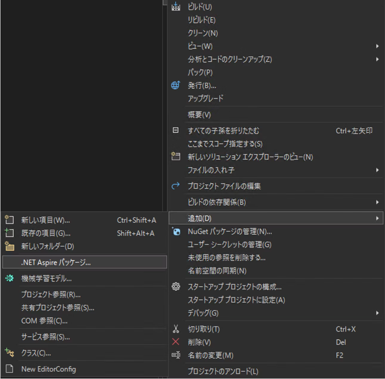
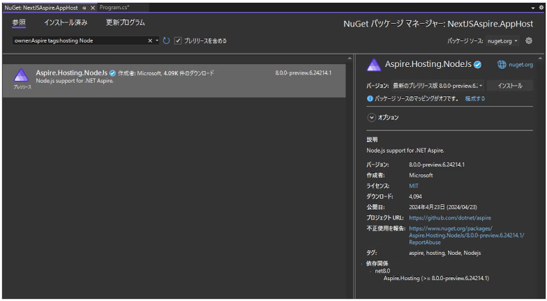

# プロジェクト作成

## 参考URL

[Next.js + ASP.NET Core を .NET Aspire で構成する（with YARP）](https://qiita.com/takashiuesaka/items/e167852af299a7b00939)

## ステップ

### 1. WebAPI を ASP.NET Core で作る

#### 空のソリューションを作る

- 空のソリューション  
- ソリューション名: `NextJSAspire`

#### ASP.NET CORE を作成

- ASP.NET Core Web API
- プロジェクト名: `WebApi`


### 2. フロントエンドを Next.js で作る

ソリューションファイルを作った階層を PowerShell で開き、次のコマンドを入力

```powershell
npx create-next-app@latest
```

```powershell
PS C:\Repos\nextjs-aspire> npx create-next-app@latest
Need to install the following packages:
create-next-app@14.2.3
Ok to proceed? (y) y
√ What is your project named? ... frontend
√ Would you like to use TypeScript? ... No / Yes
√ Would you like to use ESLint? ... No / Yes
√ Would you like to use Tailwind CSS? ... No / Yes
√ Would you like to use `src/` directory? ... No / Yes
√ Would you like to use App Router? (recommended) ... No / Yes
√ Would you like to customize the default import alias (@/*)? ... No / Yes
√ What import alias would you like configured? ... @/*
Creating a new Next.js app in C:\Repos\nextjs-aspire\frontend.
```

### 3. Next.js アプリケーションを .NET Aspire 管理にする

Node.jsプロジェクトを .NET Aspire で管理する場合、ライブラリ参照が必要です。  
AppHost　プロジェクトを右クリック→追加→.NET Aspire パッケージを選択します。  



表示された NuGet パッケージマネージャー画面には既定で検索文字列が入力されています。その検索文字列に半角スペースと Node という文字列を追加すると、Node.jsをホストするためのパッケージが表示されますので、インストールします。



AppHost プロジェクトの Program.cs を開いて、次のように実装します。

```cs
using Microsoft.Extensions.Hosting;

var builder = DistributedApplication.CreateBuilder(args);

//builder.AddProject<Projects.WebApi>("webapi");

var api = builder.AddProject<Projects.WebApi>("webapi");

var frontend = builder.AddNpmApp(name: "frontend", workingDirectory: "../frontend", scriptName: "dev")
    .WithHttpEndpoint(env: "PORT")
    .WithExternalHttpEndpoints()
    .WithReference(api);

if (builder.Environment.IsDevelopment() && builder.Configuration["DOTNET_LAUNCH_PROFILE"] == "https")
{
    // Disable TLS certificate validation in development, see + https://github.com/dotnet/aspire/issues/3324 for more details.
    frontend.WithEnvironment("NODE_TLS_REJECT_UNAUTHORIZED", "0");
}

builder.Build().Run();
```
