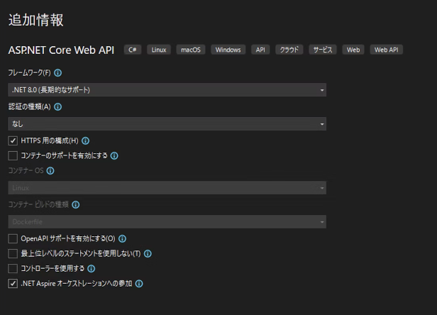

# プロジェクト作成

## 参考URL

[Next.js + ASP.NET Core を .NET Aspire で構成する（with YARP）](https://qiita.com/takashiuesaka/items/e167852af299a7b00939)

## ステップ

### 1. WebAPI を ASP.NET Core で作る

#### 空のソリューションを作る

- 空のソリューション  
- ソリューション名: `NextJSAspire`

#### ASP.NET CORE を作成

- ASP.NET Core Web API
- プロジェクト名: `WebApi`



### 2. フロントエンドを Next.js で作る

ソリューションファイルを作った階層を PowerShell で開き、次のコマンドを入力

```powershell
npx create-next-app@latest
```

```powershell
PS C:\Repos\nextjs-aspire> npx create-next-app@latest
Need to install the following packages:
create-next-app@14.2.3
Ok to proceed? (y) y
√ What is your project named? ... frontend
√ Would you like to use TypeScript? ... No / Yes
√ Would you like to use ESLint? ... No / Yes
√ Would you like to use Tailwind CSS? ... No / Yes
√ Would you like to use `src/` directory? ... No / Yes
√ Would you like to use App Router? (recommended) ... No / Yes
√ Would you like to customize the default import alias (@/*)? ... No / Yes
√ What import alias would you like configured? ... @/*
Creating a new Next.js app in C:\Repos\nextjs-aspire\frontend.
```
