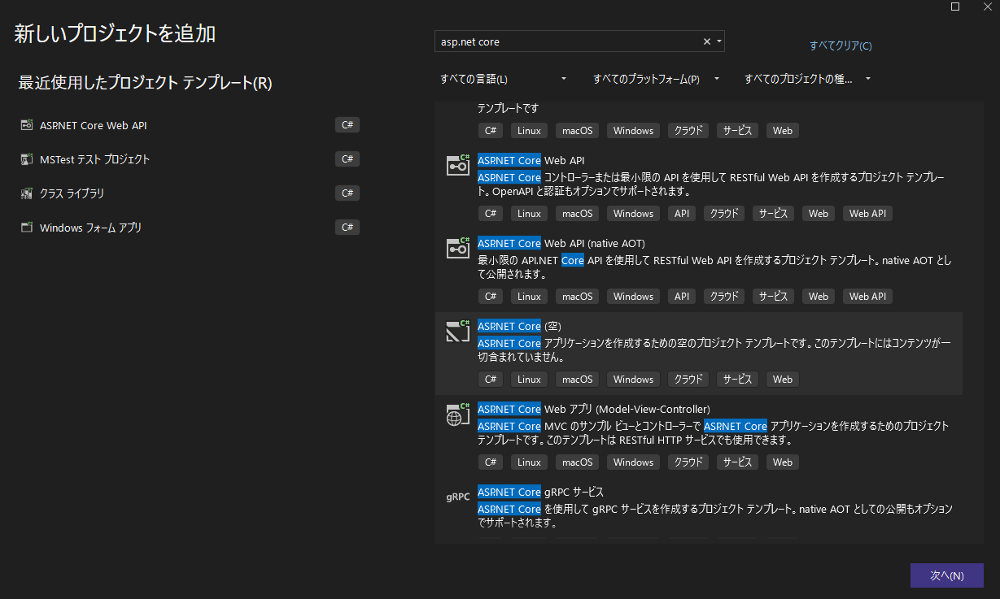
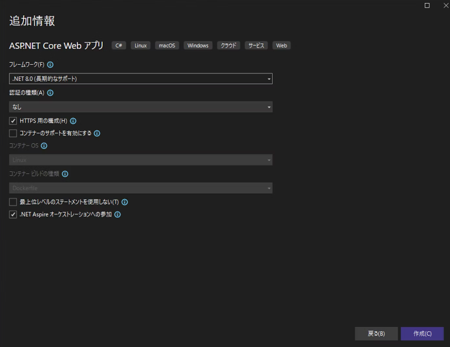
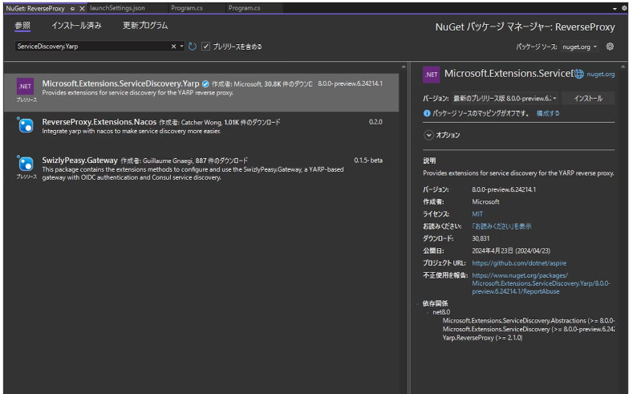

# Next.js から WebAPIを叩く

## ステップ

### WebApiのエンドポイントを変更

Next.js の実装をする前に、少しだけ WebAPI を修正します。WebAPI のエンドポイントは必ず /api の下になるようにします。WebAPI プロジェクトの Program.cs を次のように修正します。

e.g.  

```cs
var builder = WebApplication.CreateBuilder(args);

builder.AddServiceDefaults();

// Add services to the container.

var app = builder.Build();

app.MapDefaultEndpoints();

// Configure the HTTP request pipeline.

app.UseHttpsRedirection();

var summaries = new[]
{
    "Freezing", "Bracing", "Chilly", "Cool", "Mild", "Warm", "Balmy", "Hot", "Sweltering", "Scorching"
};


- app.MapGet("/weatherforecast", () =>
+ app.MapGet("api/weatherforecast", () =>
{
    var forecast =  Enumerable.Range(1, 5).Select(index =>
        new WeatherForecast
        (
            DateOnly.FromDateTime(DateTime.Now.AddDays(index)),
            Random.Shared.Next(-20, 55),
            summaries[Random.Shared.Next(summaries.Length)]
        ))
        .ToArray();
    return forecast;
});

app.Run();

record WeatherForecast(DateOnly Date, int TemperatureC, string? Summary)
{
    public int TemperatureF => 32 + (int)(TemperatureC / 0.5556);
}
```

### Server Components から WebApi を叩く

#### server/page.tsx を修正

`frontend\src\app\server\page.tsx`

```tsx
const getData = async () => {

    const apiServer = process.env['services__webapi__https__0'] ?? process.env['services__webapi__http__0'];
    const weatherData: Response = await fetch(`${apiServer}/api/weatherforecast`, { cache: 'no-cache' });

    if (!weatherData.ok) {
        throw new Error('Failed to fetch data.');
    }

    const data = await weatherData.json();

    return data
}

const Page = async () => {
    const data = await getData()

    return <main>{JSON.stringify(data)}</main>
}

export default Page
```

> services__webapi__https__0 と services__webapi__http__0 という　環境変数の値に WebAPI のホスト名が格納されている。

### Client Components から WebApi を叩く

#### client/page.tsx を修正

`frontend\src\app\client\page.tsx`

```tsx
'use client'

import { useEffect, useState } from 'react';

const getData = async () => {
  // NOTE:  WebApi プロジェクトの launchSettings.json ファイル > profiles > http > applicationUrl
  // "applicationUrl": "http://localhost:5291",
  const weatherData: Response = await fetch('http://localhost:5291/api/weatherforecast', { cache: 'no-cache' })

  if(!weatherData.ok) {
    throw new Error('Failed to fetch data.')
  }

  const data = await weatherData.json();
  return data;
}

const ClientPage = () => {
  // console.log('running in client')

  const [data, setData] =  useState([]);

  useEffect(() => {
    getData().then((data) => setData(data));
  }, [])

  return (
    <main>
      {JSON.stringify(data)}
    </main>
  )
}

export default ClientPage
```

この時点では、CORSエラーが発生するため、次のステップで Reverse Proxy を実装する。

### YARP で Reverse Proxy を実装する

#### 空の ASP.NET Core アプリケーションを追加する

- ASP.NET Core（空）
- プロジェクト名: `ReverseProxy`





#### AppHost プロジェクトで参照先を実装する

`NextJSAspire.AppHost\Program.cs`

```cs
using Microsoft.Extensions.Hosting;

var builder = DistributedApplication.CreateBuilder(args);

//builder.AddProject<Projects.WebApi>("webapi");

var api = builder.AddProject<Projects.WebApi>("webapi");

var frontend = builder.AddNpmApp(name: "frontend", workingDirectory: "../frontend", scriptName: "dev")
    .WithHttpEndpoint(env: "PORT")
    .WithExternalHttpEndpoints()
    .WithReference(api);

if (builder.Environment.IsDevelopment() && builder.Configuration["DOTNET_LAUNCH_PROFILE"] == "https")
{
    // Disable TLS certificate validation in development, see + https://github.com/dotnet/aspire/issues/3324 for more details.
    frontend.WithEnvironment("NODE_TLS_REJECT_UNAUTHORIZED", "0");
}

builder.AddProject<Projects.ReverseProxy>("reverseproxy")
    .WithReference(frontend)
    .WithReference(api);

builder.Build().Run();
```

#### Microsoft.Extensions.ServiceDiscovery.Yarp をインストールする

1. Reverse Proxy プロジェクトの Nuget パッケージの管理画面を開く。
2. Microsoft.Extensions.ServiceDiscovery.Yarp をインストールする。



#### Reverse Proxy を実装する

`ReverseProxy\Program.cs`

```cs
using Yarp.ReverseProxy.Configuration;

var builder = WebApplication.CreateBuilder(args);

// NOTE: ServiceDiscovery を有効とする。
// AppHost プロジェクトで実装した Next.js と WebAPI プロジェクトへの参照を SerivceDiscovery で解決できるようになるが、
// YARP の場合は、これだけでは、ServiceDiscovery ができない。
builder.AddServiceDefaults();

// NOTE: AddReverseProxy は Yarp.ReverseProxy パッケージに含まれている YARP を使用することをパイプラインに適用するためのメソッド。
// Add したら　Use するのがパイプラインの基本なので、Use を後で実装している（今回は、Map～ が Use に相当する）。
builder.Services.AddReverseProxy()
    .LoadFromMemory(GetRoutes(), GetClusters())
    .AddServiceDiscoveryDestinationResolver();

var app = builder.Build();

app.MapDefaultEndpoints();

// NOTE: パイプラインのUse
app.MapReverseProxy();

app.Run();

// GetRoutes メソッドで振り分けのルールを定義
RouteConfig[] GetRoutes()
{
    return
    [
        new RouteConfig
        {
            RouteId = "Route1",
            ClusterId = "default",
            Match = new RouteMatch { Path = "{**catch-all}" }
        },
        new RouteConfig
        {
            RouteId = "Route2",
            ClusterId = "api",
            Match = new RouteMatch { Path = "/api/{*any}" }
        },
    ];
}

// GetClusters メソッドで振り分け先のパスを定義
ClusterConfig[] GetClusters()
{
    return
    [
        new ClusterConfig
        {
            ClusterId = "default",
            Destinations = new Dictionary<string, DestinationConfig>
            {
                { "destination1", new DestinationConfig { Address = "http://frontend" } },
            }
        },
        new ClusterConfig
        {
            ClusterId = "api",
            Destinations = new Dictionary<string, DestinationConfig>
            {
                { "destination2", new DestinationConfig { Address =  "http://webapi", Host = "localhost" } },
            }
        },
    ];
}
```

> <http://frontend>, <http://webapi> と AppHost プロジェクトの Program.cs で定義した名称を使って振り分け先を定義。
>　webapi の設定の方だけにHost = "localhost" という設定があるが、https に対するリクエスト時に必要。

#### WebApi に、Reverse Proxy からのアクセスを許可するよう実装を修正

`WebApi\Program.cs`

```cs
var builder = WebApplication.CreateBuilder(args);

builder.AddServiceDefaults();

// ---- 追加 ここから ---- //
builder.Services.AddCors(x =>
{
    x.AddDefaultPolicy(policy =>
    {
        policy.AllowAnyHeader();
        policy.AllowAnyMethod();
        policy.AllowCredentials();
        policy.WithOrigins(new string[] { "https://localhost:7213", "http://localhost:5172" });
        // NOTE: 全ての Origin を許可する場合は、下記コード
        // policy.SetIsOriginAllowed(origin => true); 
    });
});
// ---- 追加 ここまで ---- //

// Add services to the container.

var app = builder.Build();

// ---- 追加 ここから ---- //
app.UseCors();  // CORS有効のために追加
// ---- 追加 ここまで ---- //

app.MapDefaultEndpoints();

...
```

#### Next.js の CSR から WebAPI の呼び出し実装を修正

Next.js の CSR の実装では WebAPI のアクセス先のホスト名を直書きしていたが、ReverseProxy によって /api へアクセスすれば WebAPI にトラフィックが振り分けられるようになったので、ホスト名を削除する。

`frontend\src\app\client\page.tsx`

```tsx
'use client'

import { useEffect, useState } from 'react';

const getData = async () => {
  // NOTE:  WebApi プロジェクトの launchSettings.json ファイル > profiles > http > applicationUrl
  // "applicationUrl": "http://localhost:5291",
  const weatherData: Response = await fetch('/api/weatherforecast', { cache: 'no-cache' })

  ...
}
```

ダッシュボードに ReverseProxy のリソースが増えているので、ReverseProxy のエンドポイントのリンクをクリックして初期画面を表示後、/client にアクセスして、WebApiからデータを取得可能か確認する。
